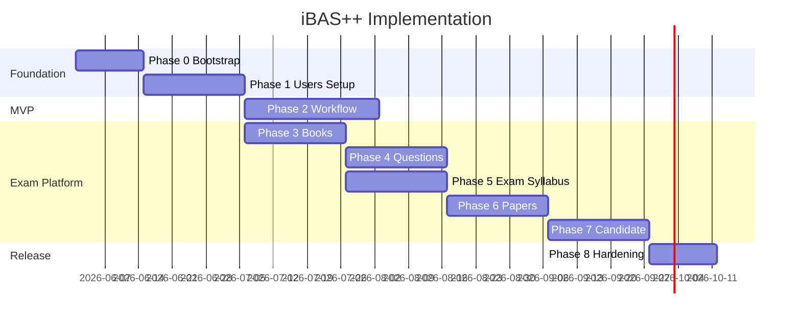

# iBAS++ Implementation Plan

**Stack:** Express.js · MongoDB Atlas · Next.js · Tailwind CSS · ShadCN UI  
**Schema:** v3.2 — [`planning/ibas_unified_mongodb_schema.md`](../planning/ibas_unified_mongodb_schema.md)  
**Reference UI:** [`ibas_task_admin_builder.html`](../ibas_task_admin_builder.html) (workflow admin + run guide)

---

## 1. Goals & scope

### Product goals

| Goal | Module(s) |
|------|-----------|
| Guided role-based task workflow (bills, HR, etc.) | G, H |
| User & admin management with Bengali-first UI | A |
| Geography & system setup | B |
| Books, rules, question bank, exams | C–J |

### Out of scope (Phase 1)

- Mobile native apps
- Bangladesh Bank / external EFT integration (mock auto-steps only)
- Production SMS/email gateways (stub workers; wire later)

### Success criteria (MVP — Phase 1–2)

- Super admin creates users with optional workflow role tags
- Admin builds tasks via step builder (port of HTML prototype)
- Officer completes task run end-to-end (SDO → DDO → AO → SYSTEM)
- Handoff notifications + append-only audit log
- Default locale Bengali; English where `_en` fields exist

---

## 2. Architecture summary

```
Browser
  └── Next.js (web) — ShadCN, next-intl (bn primary)
        └── /api/proxy/*  BFF
              └── Express (api) — domains/, authorize(), transactions
                    └── MongoDB Atlas — 37 collections
                    └── Redis (staging+) — BullMQ jobs
```

| Concern | Decision | Doc |
|---------|----------|-----|
| Monorepo | pnpm workspaces + Turborepo | `PROJECT_STRUCTURE.md` |
| API layout | `domains/` not `modules/` | `PROJECT_STRUCTURE.md` |
| Auth | JWT access + httpOnly refresh via BFF | `API_CONVENTIONS.md` |
| RBAC | 3 layers + `authorize()` | `PERMISSIONS.md` |
| i18n | `_bn` required, `_en` optional in DB | `I18N_CONVENTION.md` |
| Workflow roles | Optional `users.workflow_roles[]`, no office | Schema A1 |

---

## 3. Repository bootstrap (Phase 0)

**Duration:** 1–2 weeks  
**Outcome:** Both apps run locally; DB connected; login shell works.

### 3.1 Init monorepo

```
proAssist/
├── apps/api/
├── apps/web/
├── packages/shared-types/
├── packages/shared-constants/   ← exists
├── scripts/migrations/
├── scripts/seed/
└── docs/
```

**Tasks:**

- [ ] pnpm workspace + Turborepo (`dev`, `build`, `lint`)
- [ ] TypeScript strict in all packages
- [ ] ESLint + Prettier shared config
- [ ] `.env.example` for api and web

### 3.2 Express API (`apps/api`)

- [ ] Express 4/5, helmet, cors (dev), rate-limit, pino logger
- [ ] Mongoose connect to Atlas (pooled URI)
- [ ] Global error handler + `AppError` codes (Bengali messages)
- [ ] `shared/authorize.ts`, `shared/audit/`, `shared/transactions.ts`
- [ ] Health: `GET /api/v1/health`

### 3.3 Next.js web (`apps/web`)

- [ ] Next.js 15 App Router, Tailwind, ShadCN init
- [ ] `next-intl` — `messages/bn.json` (primary), `messages/en.json`
- [ ] BFF route: `app/api/proxy/[...path]/route.ts`
- [ ] Layout: auth shell + app shell (capability-based sidebar stub)
- [ ] Design tokens from HTML prototype (primary `#1D9E75`, role badge colors)

### 3.4 Shared packages

- [ ] `shared-constants` — USER_TYPES, WORKFLOW_ROLE_CODES, MODULE_CODES
- [ ] `shared-types` — Zod schemas start with: `User`, `Credentials`, `LoginDto`
- [ ] Workflow field schema: Zod discriminated union (`text|number|select|date|otp|file`)

### 3.5 Database ops

- [ ] `scripts/migrations/create-indexes.ts` from schema index summary
- [ ] Confirm TTL retention with stakeholders before enabling
- [ ] Atlas: dev cluster + database user (least privilege)

### Phase 0 deliverable

Login page (bn) → JWT → empty dashboard. CI: lint + typecheck on push.

---

## 4. Phase 1 — Foundation: Users & Setup (Modules A + B)

**Duration:** 2–3 weeks  
**Depends on:** Phase 0

### 4.1 Backend — Module A

| Collection | Endpoints |
|------------|-----------|
| `users` | CRUD, list, filter by `user_type` / `status` |
| `credentials` | Internal only (never expose hash) |
| `user_addresses` | CRUD nested under user |
| `user_professions` | CRUD nested under user |
| `user_payment_info` | CRUD nested under user |
| `user_module_access` | Grant/revoke module permissions |
| `user_activity_log` | Read-only list per user |

**Auth domain:**

```
POST /auth/register
POST /auth/login
POST /auth/refresh
POST /auth/logout
POST /auth/otp/send
POST /auth/otp/verify
POST /auth/password/forgot
POST /auth/password/reset
GET  /users/me
```

**Workflow role tags:**

```
POST   /users/:id/workflow-roles
DELETE /users/:id/workflow-roles/:roleCode
```

**Tasks:**

- [ ] Mongoose models + Zod validators (Bengali-first fields)
- [ ] bcrypt passwords; lockout after N failures
- [ ] OTP stub worker (`jobs/send-otp`)
- [ ] Audit log on login/logout/password change
- [ ] Seed: super admin user

### 4.2 Backend — Module B

| Collection | Endpoints |
|------------|-----------|
| `divisions`, `districts`, `thanas` | CRUD + cascade list |
| `professions`, `payment_methods` | CRUD |
| `modules` | CRUD + seed 8 iBAS modules |

**Tasks:**

- [ ] Cascading geography API: `/setup/divisions/:id/districts/:id/thanas`
- [ ] Seed script: sample divisions/districts/thanas, 8 modules from HTML
- [ ] Seed MODULE_CODES in `shared-constants`

### 4.3 Frontend — Module A + B

| Screen | Route |
|--------|-------|
| Login / OTP / forgot password | `/login`, `/verify-otp` |
| User list & create/edit | `/admin/users` |
| Workflow role tag editor | User form section |
| Module access matrix | `/admin/users/:id/access` |
| Geography admin | `/admin/setup/geography` |
| Professions & payment methods | `/admin/setup/...` |

**Components:**

- [ ] Cascading Division → District → Thana selects
- [ ] Data tables (ShadCN + TanStack Table)
- [ ] TanStack Query hooks per resource

### Phase 1 deliverable

Super admin creates officer with `workflow_roles: [{ role_code: 'SDO' }]`, assigns module access, manages geography.

---

## 5. Phase 2 — Workflow engine (Modules G + H) ⭐ MVP core

**Duration:** 3–4 weeks  
**Depends on:** Phase 1  
**UI reference:** `ibas_task_admin_builder.html`

### 5.1 Backend — Module G

| Collection | Priority |
|------------|----------|
| `roles` | Seed SDO, DDO, AO, FD, ADMIN, SYSTEM |
| `tasks` | Full CRUD + publish |
| `task_steps` | Nested CRUD, reorder |
| `task_runs` | Start, advance, reject, cancel |
| `step_responses` | One per step per run |

**Endpoints:**

```
# Admin — task builder
GET/POST/PATCH/DELETE  /workflow/tasks
GET/POST/PATCH/DELETE  /workflow/tasks/:id/steps
PATCH                  /workflow/tasks/:id/steps/reorder
POST                   /workflow/tasks/:id/publish

# Runtime
POST   /workflow/tasks/:id/runs
GET    /workflow/runs/:id
GET    /workflow/inbox
POST   /workflow/runs/:id/steps/:n/respond

# Reference
GET    /workflow/roles
```

**Schema additions (PDF/HTML gaps — apply Bengali-first):**

| Collection | Fields to add |
|------------|---------------|
| `tasks` | `name_bn`, `name_en`, `updated_by`, `avg_duration_ms` |
| `task_steps` | `title_bn/en`, `description_bn/en`, `condition_type`, `screenshot_url`, `help_text_bn/en`, `fields[].options` |
| `task_runs` | `duration_ms`, `rejection_reason`, `rejected_by`, `cancelled_by`, status `draft` |
| `step_responses` | Rich `attachments[]`, `condition_met`, `started_at`, `duration_ms`, `ip_address` |

**Tasks:**

- [ ] `WorkflowService.startRun()` — transaction: run + audit + notification
- [ ] `WorkflowService.advanceStep()` — validate role tag vs `current_role`
- [ ] Dynamic field validation from `task_steps.fields` (Zod per type)
- [ ] Auto step worker for `is_auto: true` steps
- [ ] Seed: "Submit monthly salary bill" (6 steps from HTML)

### 5.2 Backend — Module H

| Collection | Endpoints |
|------------|-----------|
| `notifications` | `GET /notifications`, `PATCH /notifications/:id/read` |
| `audit_logs` | `GET /audit/logs` (admin only), append-only writes |

**Tasks:**

- [ ] Notification on handoff (`handoff_msg`, recipient by role tag)
- [ ] Audit middleware on all mutating routes
- [ ] TTL on notifications (90d) — confirm before enable

### 5.3 Frontend — Workflow (port HTML prototype)

| HTML tab | Next.js route | API |
|----------|---------------|-----|
| Admin — task list + editor | `/workflow/admin` | tasks, task_steps |
| Admin — step builder | embedded | steps CRUD, reorder |
| Admin — flow preview | embedded | ordered steps + role colors |
| Tasks overview | `/workflow/tasks` | tasks list |
| Run guide | `/workflow/guide` | runs, step_responses |

**Components to build:**

- [ ] `TaskList`, `TaskEditor`, `StepBuilder`, `FlowPreview`
- [ ] `FieldTagInput` → full `FieldBuilder` (type, validation, options)
- [ ] `GuideRunner` — progress bar, step form renderer, handoff box
- [ ] `WorkflowInbox` — pending runs for user's role tags
- [ ] Role badge component (colors from `roles.color`)

### Phase 2 deliverable

Full demo: Admin creates task → SDO starts run → submits OTP step → DDO approves → AO approves → SYSTEM auto step → completed. Notifications + audit visible.

**This completes the workflow MVP.**

---

## 6. Phase 3 — Books & regulations (Module C)

**Duration:** 2–3 weeks  
**Depends on:** Phase 1

### Backend

- [ ] 10 collections: `book_types` → `regulation_amendments`
- [ ] Tree API: `GET /books/:id/tree?depth=N`
- [ ] Bengali-first on all name/description fields

### Frontend

- [ ] Tree navigator (lazy expand)
- [ ] Rich text editor (TipTap) for rules — Bengali default
- [ ] Regulation search + amendment history

### Deliverable

Sample GFR book browsable with at least one amendment.

---

## 7. Phase 4 — Question bank (Module D)

**Duration:** 2–3 weeks  
**Depends on:** Phase 3

### Backend

- [ ] Questions + options + answers + explanations
- [ ] Link to book chapter/topic/regulation (not syllabus_topic_id)
- [ ] Publish workflow (`is_published`)

### Frontend

- [ ] Question CRUD with MCQ option editor
- [ ] Filters: chapter, difficulty, published status
- [ ] Preview mode

### Deliverable

Published MCQ set linked to book content.

---

## 8. Phase 5 — Exam setup & syllabus (Modules E + F)

**Duration:** 2–3 weeks  
**Depends on:** Phase 3

### Backend

- [ ] Hierarchy: department → authority → exam_name → part → type → subject
- [ ] Syllabus: groups → topics → sub_topics → references
- [ ] `syllabus_references` cross-links to books

### Frontend

- [ ] Exam config wizard
- [ ] Syllabus tree + reference picker

### Deliverable

SAS exam structure with syllabus mapped to book chapters.

---

## 9. Phase 6 — Paper management (Module I)

**Duration:** 2–3 weeks  
**Depends on:** Phase 4, 5

### Backend

- [ ] Paper types, details, groups, questions, child questions
- [ ] Transaction on paper compose

### Frontend

- [ ] Paper composer: sections, question picker, marks allocation
- [ ] Publish paper

### Deliverable

Published practice paper for one exam subject.

---

## 10. Phase 7 — Candidate lifecycle (Module J)

**Duration:** 3 weeks  
**Depends on:** Phase 5, 6

### Backend

- [ ] Registrations, schedules, results, result details, appeals
- [ ] Payment status flow (stub)

### Frontend

- [ ] Applicant portal: register, schedule, results, appeal
- [ ] Admin: approve registrations, publish results

### Deliverable

Applicant registers → model test result → appeal submitted.

---

## 11. Phase 8 — Hardening & release

**Duration:** 2+ weeks  
**Depends on:** Phases 1–7 (or 1–2 for workflow-only release)

- [ ] E2E Playwright: login, task builder, full run
- [ ] Load test workflow inbox query
- [ ] Security review: RBAC, rich text sanitize, upload limits
- [ ] Bengali UI pass (all static strings in `bn.json`)
- [ ] Staging deploy (API + Web + Atlas + Redis)
- [ ] Backup & restore drill on Atlas
- [ ] Admin docs / runbook

---

## 12. Timeline overview

| Phase | Focus | Weeks | Cumulative |
|-------|--------|-------|------------|
| 0 | Bootstrap | 1–2 | 2 |
| 1 | Users & Setup (A, B) | 2–3 | 5 |
| 2 | Workflow (G, H) — **MVP** | 3–4 | 9 |
| 3 | Books (C) | 2–3 | 12 |
| 4 | Questions (D) | 2–3 | 15 |
| 5 | Exam & Syllabus (E, F) | 2–3 | 18 |
| 6 | Papers (I) | 2–3 | 21 |
| 7 | Candidate (J) | 3 | 24 |
| 8 | Hardening | 2+ | 26+ |

**Workflow-only MVP:** Phases 0 + 1 + 2 ≈ **9 weeks**  
**Full platform:** ≈ **26 weeks** (1 dev); parallel work reduces calendar time.



---

## 13. Team & parallelism

| Role | Phases |
|------|--------|
| 1 backend dev | API domains, migrations, workers |
| 1 frontend dev | Next.js screens, ShadCN, workflow UI |
| 1 full-stack (optional) | Phase 2 workflow (critical path) |

**Parallel tracks after Phase 1:**

- Track A: Phase 2 workflow (critical)
- Track B: Phase 3 books (can start once B geography seed exists)

---

## 14. Implementation order within each domain

Every Express domain follows the same slice:

```
1. Zod schema (shared-types)
2. Mongoose model + indexes
3. Service (business logic + transactions)
4. Controller
5. Routes + authorize middleware
6. Integration test
7. Frontend hooks + pages
```

---

## 15. Key technical tasks checklist

### Security

- [ ] httpOnly refresh cookie; access token short-lived
- [ ] Input sanitization on rich text (`body_bn`, rules)
- [ ] File upload: type whitelist, size cap, virus scan (later)
- [ ] Rate limit auth routes
- [ ] Atlas IP allowlist + scoped DB user

### Data

- [ ] All indexes from schema v3.2
- [ ] Transactions on workflow advance + paper publish
- [ ] Append-only audit_logs (no update/delete in code)

### i18n

- [ ] Default `locale=bn` in API display helper
- [ ] All form labels in `messages/bn.json`
- [ ] User-generated content: always save `*_bn`; `_en` optional

### DevOps

- [ ] Docker Compose: api + web + redis (local)
- [ ] GitHub Actions: lint, typecheck, test
- [ ] Env separation: dev / staging / prod Atlas clusters

---

## 16. Risk register

| Risk | Impact | Mitigation |
|------|--------|------------|
| 37 collections — scope creep | High | Strict phase gates; workflow MVP first |
| Dynamic step forms | Medium | Zod discriminated union; FieldRenderer component |
| Bengali rich text / fonts | Medium | Test Noto Sans Bengali early in Tailwind |
| Workflow role confusion | High | Documented in PERMISSIONS.md; single authorize() |
| PDF schema gaps | Low | Phase 2 schema additions listed in §5.1 |
| TTL deletes wanted data | Medium | Stakeholder sign-off before migration |

---

## 17. Definition of done (per phase)

- [ ] All endpoints documented (OpenAPI or README)
- [ ] Zod schemas match Mongoose models
- [ ] Indexes created via migration script
- [ ] authorize() on every mutating route
- [ ] Audit log on mutating routes
- [ ] Bengali error messages
- [ ] Seed script for demo data
- [ ] Manual test checklist passed

---

## 18. Immediate next actions (Week 1)

1. Create monorepo scaffold (Phase 0)
2. Provision MongoDB Atlas dev cluster
3. Implement `users` + `credentials` + auth login
4. Next.js login page + BFF proxy
5. Seed super admin + 8 modules + 6 workflow roles

**Start command sequence:**

```bash
# After scaffold
pnpm install
pnpm dev                    # turbo: api + web
pnpm --filter api seed:roles
pnpm --filter api migrate:indexes
```

---

## 19. Document index

| Document | Purpose |
|----------|---------|
| `planning/ibas_unified_mongodb_schema.md` | Data model v3.2 |
| `docs/PROJECT_STRUCTURE.md` | Folder layout |
| `docs/PERMISSIONS.md` | RBAC rules |
| `docs/I18N_CONVENTION.md` | Bengali-first fields |
| `docs/API_CONVENTIONS.md` | REST standards |
| `docs/DENORMALIZATION.md` | Snapshot policy |
| `docs/ARCHITECTURE_FIXES.md` | Decision log |
| `ibas_task_admin_builder.html` | Workflow UI spec |

---

*iBAS++ · Implementation Plan · Schema v3.2 · May 2026*
